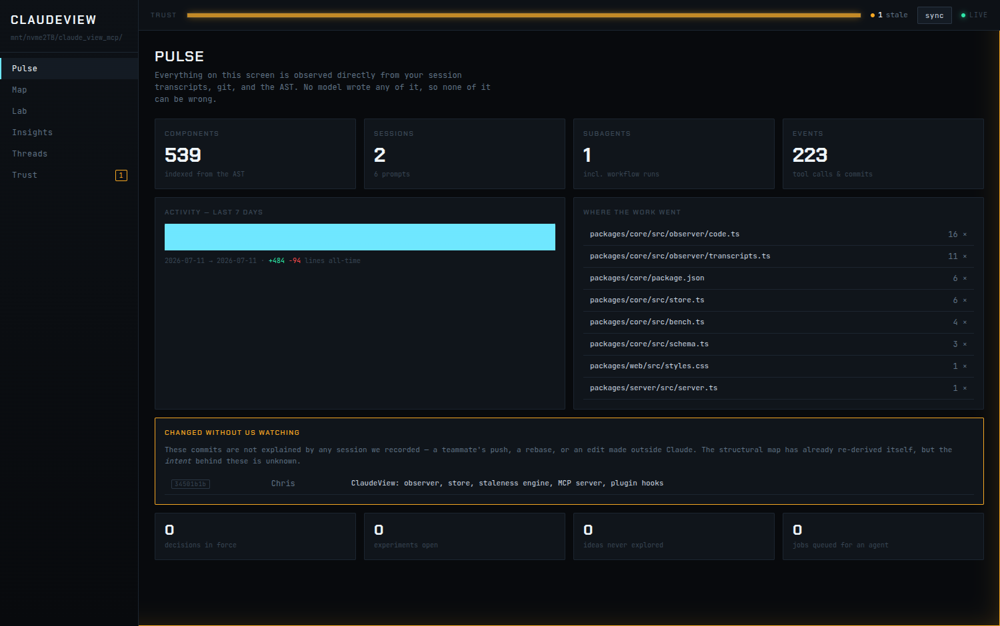

# ClaudeView

**A project consciousness for Claude Code.** It observes what actually happened, renders it
for you, and serves it back to Claude — so no session ever starts amnesiac and no document
ever lies to you without saying so.



## Install

Requires **Node ≥ 20** and Claude Code.

```bash
git clone https://github.com/ChristosG/claudeview.git
cd claudeview
corepack enable                 # provides pnpm
pnpm install && pnpm -r build
```

Put the launcher on your `PATH`:

```bash
echo "export PATH=\"$PWD/bin:\$PATH\"" >> ~/.bashrc && source ~/.bashrc
```

Or, if you already keep a `bin` directory on your `PATH`, symlink it there instead — the
launcher resolves the link and finds the checkout on its own:

```bash
ln -s "$PWD/bin/claudeview" ~/.local/bin/claudeview
```

Then, from **any** project you work on:

```bash
cd ~/your-project
claudeview
```

That opens the dashboard in your browser and starts Claude Code with the plugin attached. The
port is derived from the project root, so it's the same every time for a given repo — no
matter which subdirectory you launch from — and different repos never collide. Pin the tab.

Inside Claude:

- **`/cv-init`** — cold-start: read the whole session history, index the code, build the map.
- **`/cv`** — what's stale, what's open, what failed, what was never tried.
- **`/cv-drain`** — run the analysis jobs the dashboard queued.

<details>
<summary>Running it without the launcher</summary>

```bash
# plugin only
claude --plugin-dir /path/to/claudeview

# dashboard only
CLAUDE_PROJECT_DIR=/path/to/your/project CV_PORT=7777 node packages/server/dist/server.js
```

`claudeview --safe` runs without `--dangerously-skip-permissions`;
`claudeview --no-browser` starts the dashboard without opening a tab;
`claudeview --no-dashboard` skips the server entirely.

The browser is whatever `xdg-open` (or `open` on macOS) considers your default; `$BROWSER`
overrides it. Over SSH or on a tty, no tab is opened — the URL is printed instead.

</details>

---

## The problem

You ship complex projects with Claude, fast. Then you need to know *how the retrieval
mechanism actually works*, or *why we chose this*, or *did we already try that?* — and your
options are all bad:

1. **Read the code.** Slow.
2. **Read the memory / MD files.** Slow, and they rot silently.
3. **Ask Claude.** Costs tokens, costs time, and occasionally Claude tells you about an
   implementation that was superseded two weeks ago — with total confidence.

Option 3 is the dangerous one. Not because Claude is careless, but because *nothing in the
system knows when its own notes have gone out of date.*

## The discovery

**Claude Code already records everything.** Every prompt, every edit, every command and its
output, every subagent in every workflow — all of it, on disk, in
`~/.claude/projects/<slug>/*.jsonl`. One real session measured 24 MB and 12,350 records.

Nobody reads it. It's a black-box flight recorder that has never been played back.

ClaudeView plays it back.

## How it works

Three tiers, in strict order of trust.

### 1. The Observer — free, mechanical, cannot lie

Reads the transcripts (including the **nested subagent and workflow transcripts**, which on a
real project turned out to be *half of all activity* — a flat directory scan misses them),
watches git, and indexes the code with tree-sitter.

Zero tokens. No API key. It cannot be wrong about what it reports, because everything it
says is derived from bytes on disk rather than from anyone's memory.

### 2. The Interpreter — meaning, model-routed

The AST knows the *shape* of your code but nothing about its *meaning*. So Claude annotates
components, authors the pipeline diagrams, summarises sessions, and mines your transcripts
for the ideas you raised and never pursued.

### 3. The Auditor — adversarial, and strictly read-only

Red-teams the code and records what's wrong, suboptimal, or quietly deceptive. **It never
fixes anything.** It observes and flags; the decision to change code stays yours.

## The idea that makes it work: anchored claims

Every claim ClaudeView stores — a decision, a diagram, an insight — carries the **content
hash of the code it describes.**

So when the code moves, the claim knows.

```
  Flow "Retrieval pipeline"        STALE
  ├─ Preprocess    a41f9c…  →  a41f9c…   FRESH
  ├─ Embed         77b0e2…  →  77b0e2…   FRESH
  ├─ BM25          0638395e  →  c3dcae01  STALE   ← the code beneath this box changed
  └─ Rerank        9d1e36…  →  9d1e36…   FRESH
```

A hand-drawn architecture diagram starts lying the moment someone touches the code, and it
does so *silently, for months*. An anchored one **cannot**. It tells you exactly which box
stopped being true — in milliseconds, with no model involved.

That asymmetry is the whole product: a stale claim might still be right, but a **fresh claim
is guaranteed to be about code that hasn't moved.** ClaudeView never asserts more than it can
prove. Claims that cite no code at all are shown as *unverifiable* — never as fine.

This repo ships its own map: clone it, open the **Map** screen, and you're looking at
ClaudeView's Observer pipeline diagrammed by ClaudeView, anchored to the files that implement
it. Touch one of those files and the box turns amber.

## What you get

- **Pulse** — what happened while you were gone.
- **Map** — the pipelines you actually think in (`query → embed → BM25 → rerank → LLM`),
  every box pinned to real code.
- **Lab** — your experiments, runs, and metrics. The **losses matter most**: a recorded dead
  end is the only thing standing between you and re-running it in three weeks.
- **Insights** — the adversarial feed. Dismissals are permanent; a tool that nags gets ignored.
- **Threads** — the ideas you said you'd try and never did, resurfaced at session start.
- **Trust** — what is no longer true, and exactly why.

And Claude gets the same knowledge through MCP tools, so it starts every session *oriented*
instead of blank.

## Design decisions worth knowing

**The dashboard is not the product; the substrate is.** If you never open the tab for a
month, the system still pays for itself — because Claude reads the same store at every
session start instead of re-deriving your project from scratch. It is built agent-first and
rendered human-second.

**The repo carries its own consciousness.** `.claudeview/` lives *in the repo* and is
committed as append-only JSONL — greppable, diffable, hand-editable, and it merges cleanly
when two machines both write. Clone the repo on another laptop and the knowledge comes with
it. No daemon, no account, no sync service. (Your own session log is the exception: it is
per-machine history, not shared knowledge, so it stays gitignored.)

**No API key. Anywhere.** Analysis runs as Claude Code subagents on the subscription you
already pay for. The dashboard therefore *cannot* run a model — so it queues jobs, and the
plugin drains them. Every expensive thing is visible before it costs anything.

**No embeddings.** The store is a few hundred KB of structured objects, not a codebase. BM25
plus an agent that greps it beats RAG at that size — with no GPU, no key, and no model. Which
is exactly why this runs on anyone's laptop.

## Health check

```bash
node packages/cli/dist/cli.js doctor
```

Proves the store is readable, the transcripts are being found, the index is current, and the
staleness engine actually detects a moved anchor — on your repo, on demand.

## Status

The observed tier, the staleness engine, the MCP server, the plugin hooks, and the dashboard
are built and tested. Cold-start cost calibration is deliberately unmeasured — it will be
run on a real project and the defaults reverse-engineered from what it actually costs, rather
than guessed at now.

MIT.
